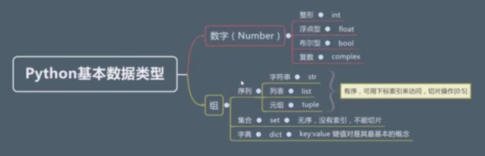

# Learn python3 笔记

### 基本数据类型

- Number
  - int
  - float
  - bool 布尔类型: 表示真、假
    - True
    - False
  - complex 复数: 数字+j
    - eg. 复数36表示为 --> 36j
- str 字符串
  - 单引号
  - 双引号
  - 三引号( 三个单引号或者三个双引号适用于多行字符串 )
    - 两种多行输入的方式
    > 利用转义字符 \ 或使用三引号
    ```
    1. 'hello world\
        hello world\
        hello world'
    2. '''
        hello world
        hello world
        hello world
       '''
    ```

```
int(True) --> 1
int(False) --> 0
bool(1) --> True
bool(0) --> False
```

- 可以被bool()方法转化为False的有
  - 任何进制、任何精度的数字0
  - 空字符串、空列表[]、空元组{}
  - None

```
1/2 --> 0.5
1//2 --> 0
2/2 --> 1.0 --> type(2/2) --> float
2//2 --> 1 --> type(2//2) --> int
```
- tips
  - / 是除法,结果是float
  - // 是在除法的基础上做一步向下取整,结果是int

### 进制的表示和转换

```
2进制的2 --> 0b10
2进制的3 --> 0b11
8进制的8 --> 0o10
8进制的9 --> 0o11
16进制的16 --> 0x10
16进制的17 --> 0x11
```
```
@param 传入任何进制的数
@binary 返回的数是param的2进制表示
bin(param): binary
```
```
@param 传入任何进制的数
@binary 返回的数是param的8进制表示
oct(param): octonary
```
```
@param 传入任何进制的数
@binary 返回的数是param的10进制表示
int(param): integer
```
```
@param 传入任何进制的数
@binary 返回的数是param的16进制表示
hex(param): hexadecimal
```

### 普通字符串与原始字符串

- r + 普通字符串 == 原始字符串

```
'C:\\north\\northeast' == r'C:\north\northeast'
```

### 字符串的运算

```
"hello" * 3 == "hellohellohello"

"hello world"[0:5] == "hello"
"hello world"[0:-1] == "hello worl"
"hello world"[6:] == "world"
"hello world"[-5:] == "world"
```

### 序列

> str( 不可变 )

> 列表list( 可变 )
```
[1, 2, 3, 4, 5, 6]
type([1, 2, 3, 4, 5, 6]) --> list
["牛肉", "羊肉", "猪肉", "鸭肉", "鱼肉"][0] --> '牛肉'
["牛肉", "羊肉", "猪肉", "鸭肉", "鱼肉"][0: 2] --> ['牛肉', '羊肉']
["牛肉", "羊肉", "猪肉", "鸭肉", "鱼肉"][-1:] --> ['鱼肉']
```

> 元组tuple( 不可变 )
```
(1, 2, 3, 4, 5, 6)
type((1, 2, 3, 4, 5, 6)) --> tuple
("牛肉", "羊肉", "猪肉", "鸭肉", "鱼肉")[0] --> '牛肉'
("牛肉", "羊肉", "猪肉", "鸭肉", "鱼肉")[0: 2] --> ('牛肉', '羊肉')
("牛肉", "羊肉", "猪肉", "鸭肉", "鱼肉")[-1:] --> ('鱼肉',)
```
```
type((1)) --> int
type(("hello")) --> str
type((1,)) --> tuple
type(("hello",)) --> tuple
type(()) --> tuple
(1+2)*2 = 6
```
- tips:
  - 只有一个元素的元组的括号和运算优先级的括号冲突
  - 故只有一个元素的元组需要多一个逗号

- 序列共有的操作
  - 序列中的每一个元素都会被分配一个序号
  - 序列的切片操作
  - 序列可以+和*

```
1 in [1,2,3] --> True
1 not in [1,2,3] --> False
4 in [1,2,3] --> False
4 not in [1,2,3] --> True
```

```
len([1, 2, 3 ,4, 5, 6]) --> 6
len("hello") --> 5
```

```
max([1, 2, 3, 5, 4]) --> 5
min([1, 2, 3, 5, 4]) --> 1
max("helloworld") --> 'w'
min("helloworld") --> 'd'
```

```
ord('a') --> 97
```

### 集合set

> 无序

```
{1,2,3,4,5,6}
type({1,2,3,4,5,6}) --> set
```

> 元素唯一性

```
{1,1,2,2,3,3,4,4,5,5,6,6} --> {1,2,3,4,5,6}
```

```
1 in {1,2,3} --> True
4 not in {1,2,3} --> True
len({1, 2, 3}) --> 3
```

- 求两个集合的差集
```
{1,2,3,4,5,6} - {3,4} --> {1,2,5,6}
```

- 求两个集合的交集
```
{1,2,3,4,5,6} & {3,4} --> {3,4}
```

- 求两个集合的并集
```
{1, 2, 3, 4, 5, 6} | {3, 4, 7} --> {1, 2, 3, 4, 5, 6, 7}
```

- 定义空的集合
```
set()
type(set()) --> set
len(set()) --> 0
```

### 字典dict( 和其他语言的对象字面量{}一样 )

```
{'q':'新月打击', 'w':'苍白之瀑', 'e':'月之降临', 'r':'月神冲刺'}
{'q':'新月打击', 'w':'苍白之瀑', 'e':'月之降临', 'r':'月神冲刺'}['q'] --> '新月打击'
```



```
@param 传入的参数是一个变量
@address 返回值是该变量在内存中的地址
id(param): address
```
可以用id()方法区分同名变量是否是同一变量

### 运算符

> 次幂的写法
```
2**2 == 4
2**5 == 32
```

> 身份运算符( is, not is )
```
a = 1
b = 1.0
a == b --> True
a is b --> False
```
- tips:
  - ==比较的是两个变量的值是否相等
  - is比较的是两个变量的身份( 内存地址 )是否相等

> Practise
```
a = {1,2,3}
b = {2,1,3}
a == b --> True ( 无序性 )
a is b --> False( 地址不同 )
```
```
a = (1,2,3)
b = (2,1,3)
a == b --> False( 序列有序 )
a is b --> False( 地址不同 )
```

> 判断值的类型
```
@variable 传入的变量
@vType 变量类型
@vTypes 一堆变量类型 { 用来判断传入的变量是否是vTypes中类型的其中一种 }
@bool 返回值类型是布尔
isinstance(variable, vType): bool
isinstance(variable, (vTypes...)): bool
```
- eg.
```
a = 'hello'
isinstance(a, str) --> True
isinstance(a, (int, str, float)) --> True
isinstance(a, (int, float)) --> False
```

- 对象的三个特征
  - 值
  - 地址
  - 类型